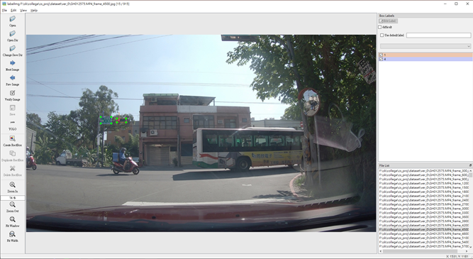
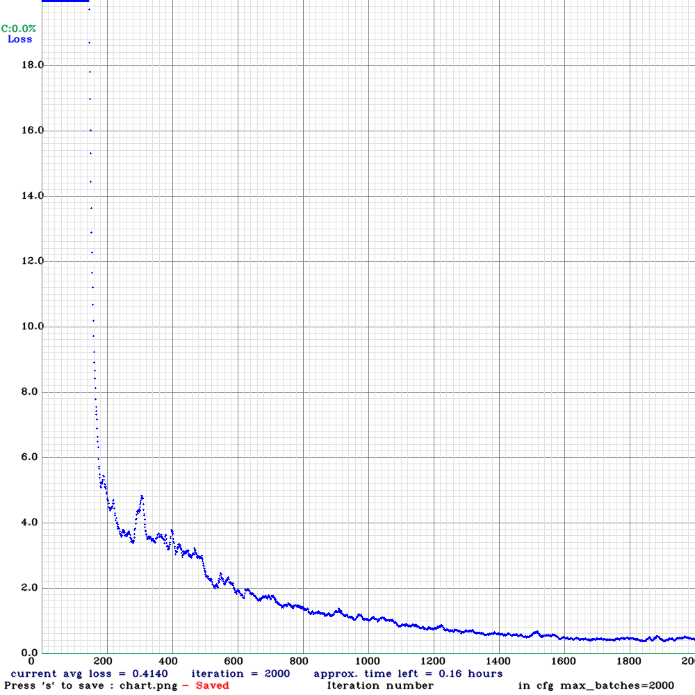
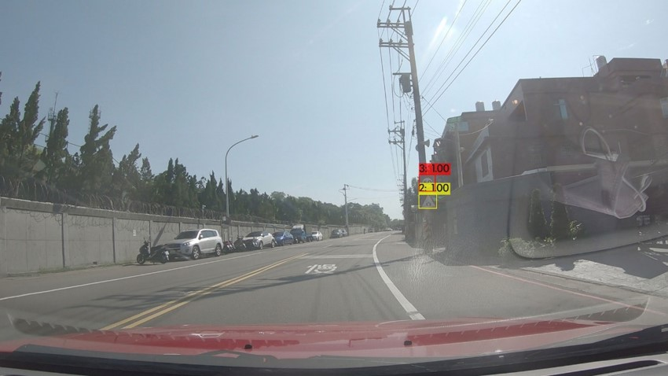
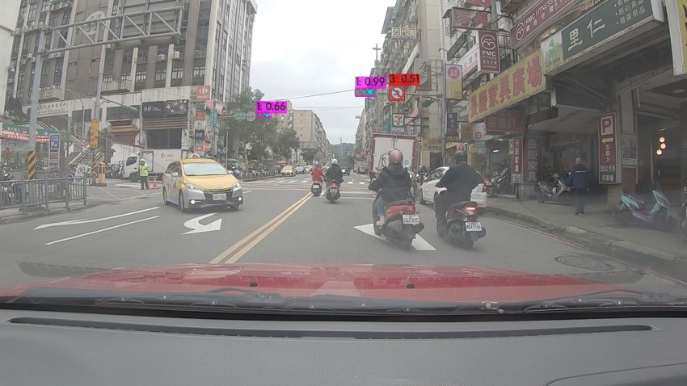
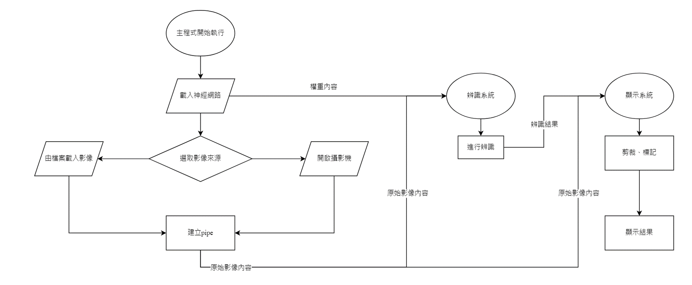

# 台灣路牌辨識

## 摘要

* 專案主要目標為製作台灣路牌辨識系統
* 目的為提供未來自駕車攝影機影像辨識基礎

## 專案流程

1. 影像取得(2 month)  
2. 影像標記(2 month)  
3. 訓練神經網路(1 month)  
4. 整合系統(1 month)  

## 影像取得&影像標記
影像取得流程  

使用LabelImg進行號誌標記  

將台灣號誌分為5類:

1. 交通號誌
2. 警告標誌
3. 指示標誌
4. 禁制標誌
5. 輔助標誌

## 訓練神經網路

* 採用Yolo V4, 368 photos, 2000 iteration

* 訓練結果  

## 整合系統

  

## 展示影片

[Youtube](https://youtu.be/47yHmeFDAB0)  

## 結論

在判斷有一定的準確性，能夠正確的判斷大多數路牌，但由於dataset不足，部分不常見的路牌容易判斷錯誤  

## How It Runs

main.py start  
-> read pre-set info  
-> get a frame from get_frame()  
-> throw frame to detector() and get results list  
-> throw results list to make_result() to cut target out and save  
-> call show_result() to show cuted out result

The detection part use The [Darknet](https://github.com/pjreddie/darknet).  
The neural network weight is trained by myself.  

## References

* [darknet github](https://github.com/pjreddie/darknet)
* [yolov4 安裝心得(參考cv2 dll部分)](https://ithelp.ithome.com.tw/articles/10231508)
* [滾動參考資料](https://www.youtube.com/watch?v=dQw4w9WgXcQ)